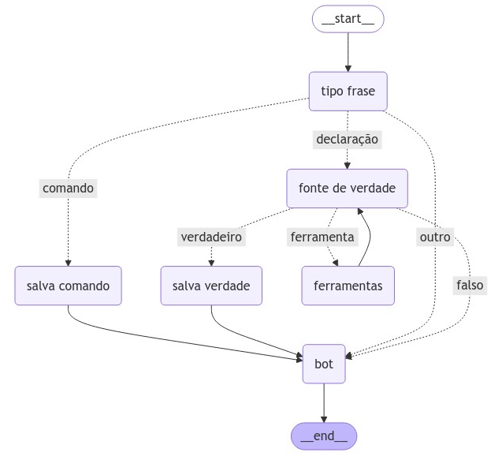

# Chatbot

Este projeto visa criar um chatbot interativo que aprenda e se adapte com base nas interações do usuário. O chatbot armazena informações relevantes apenas quando o usuário fornece dados verdadeiros ou expressa preferências (como preferir um tom mais formal).
O sistema utiliza o Langgraph para criar um grafo de execução do chat.

### Tecnologias utilizadas 
- [LangChain](https://www.langchain.com/)
- [LangGraph](https://www.langchain.com/langgraph)
- [LangSmith](https://www.langchain.com/langsmith)
- [Postgres](https://www.postgresql.org/)
- [Docker](https://www.docker.com/)
- [OpenAI](https://openai.com/)
- [Groq](https://groq.com/)
- [Streamlit](https://streamlit.io/)

O sistem possui no momento três agentes confurados. Um agente é responsável por classificar o tipo de frase 
se é declarativa (para depois validar se é verdadeira ou falsa) ou imperativa (para verificar se é uma preferencia ou comando usuário).
Outro agente funciona como uma fonte de verdade. Ele pode usar ferramentas que consulta o Wikipedia ou faz busca no DuckDuckGo 
(ou o proprio conhecimento) para validar a declaração do usuário. Um terceiro agente é o responsável por interagir com o usuário
como um assistente. Para encadear o comportamento o comportamento desses agentes foi utilizado o LangGraph. A imagem abaixo representa o grafo 
da interação entre os agentes.


 
 - Na imagem os agentes são os nós [**tipo frase**], [**source of truth**] e [**bot response**]. O nó [**truth_tools**] possui as ferramentas.
 [**salva pref**] e [**salva verdade**] são responsáveis por salva a preferencia ou comando e a afirmação verdadeira do usuário. 

## Instalação 
### 1. Docker:
 - Certifique-se de ter o [Docker](https://www.docker.com/products/docker-desktop/) na sua máquina

### 2. Chave de api:
Você pode escolher entre usar um modelo da [OpenAI](https://openai.com/) ou [Groq](https://groq.com/).
**OpenAI** tem preferencia se os dois forem configurados.
Para criar uma chave de api **OpenAI** acesse [openai.com](https://openai.com/).
Para acessar o modelo **Groq**, crie uma conta no [groq.com](https://groq.com/) e obtenha uma chave de api.

(Obs) O modelo usado pela **OpenAI** se saiu melhor, com menos resultados falso positivos. Mas pode ser um problema de enharia de prompt.
Por isso eu recomendo o modelo **OpenAI** por enquanto por ter maior precisão. O modelo usado da **OpenAI** é o 
gpt-4o-mini e o modelo usado da **Groq** são os modelos *llama3-70b-8192* e *llama3-8b-8192*.

### 3. Clone o Repositório:
```bash
git clone https://github.com/IzacPS/chatbot.git
cd chatbot
```
### 4. Variáveis de ambiente:
Configure a variável de ambiente **GROQ_API_KEY** ou **OPENAI_API_KEY** com a chave de api.

- bash

    ```
    export OPENAI_API_KEY="sua_chave_de_api_aqui"
    ```
    ou
    ```
    export GROQ_API_KEY="sua_chave_de_api_aqui"
    ```
- powershell
    ```
    $env:OPENAI_API_KEY="sua_chave_de_api_aqui"
    ```
    ou
    ```
    $env:GROQ_API_KEY="sua_chave_de_api_aqui"
    ```
### 3. Executar:

Para executar o projeto basta usar o  *docker compose*.
Primeiro faça o build das imagens.

```bash
docker compose build
```
Em seguida basta subir as imagens com o comando.
```bash
docker compose up
```

Se preferir você pode buildar e executar ao mesmo tempo com o comando. Lembrando que
esse comando irá reconstruir as imagens do zero a cada execução.
```bash
docker compose up --build
```

Agora você pode acessar o chat em `http://localhost:8501`.


## Configurações adicionais (Opcional)

### 1. Ferramentas de busca:
O agente que funciona como a fonte de verdade, por padrão não usa nenhuma ferramenta.
Então a validação da da mensagem do usuário é feita diretamente pelo que o modelo sabe.
Duas ferramentas podem ser usadas com no agente de verdade para buscar por essa informação
na Wikipedia e uma busca no DuckDuckGo. Para ativar essas ferramentas você pode passar o seguinte
parametro:
bash
```
export ENABLE_TOOLS="true"
```
powershell
```
$env:ENABLE_TOOLS="true"
```
O agente irá então usar as informações vindas dessas ferramentas, analizar o contexto do resultado
e validar se o que o usuário afirmou é verdade.

### 2. Langsmith:
Você pode optar por usar a plataforma **Langsmith** para depurar os estados no **Langgraph**.
Crie uma conta, ou logue no [Langsmith](https://www.langchain.com/langsmith) e obtenha uma chave de api.
Após obter a chave você pode configurar da seguinte forma:

bash
```
export LANGCHAIN_TRACING_V2="true"
export LANGCHAIN_API_KEY="sua_chave_de_api_aqui"
```
powershell
```
$env:LANGCHAIN_TRACING_V2="true"
$env:LANGCHAIN_API_KEY="sua_chave_de_api_aqui"
```